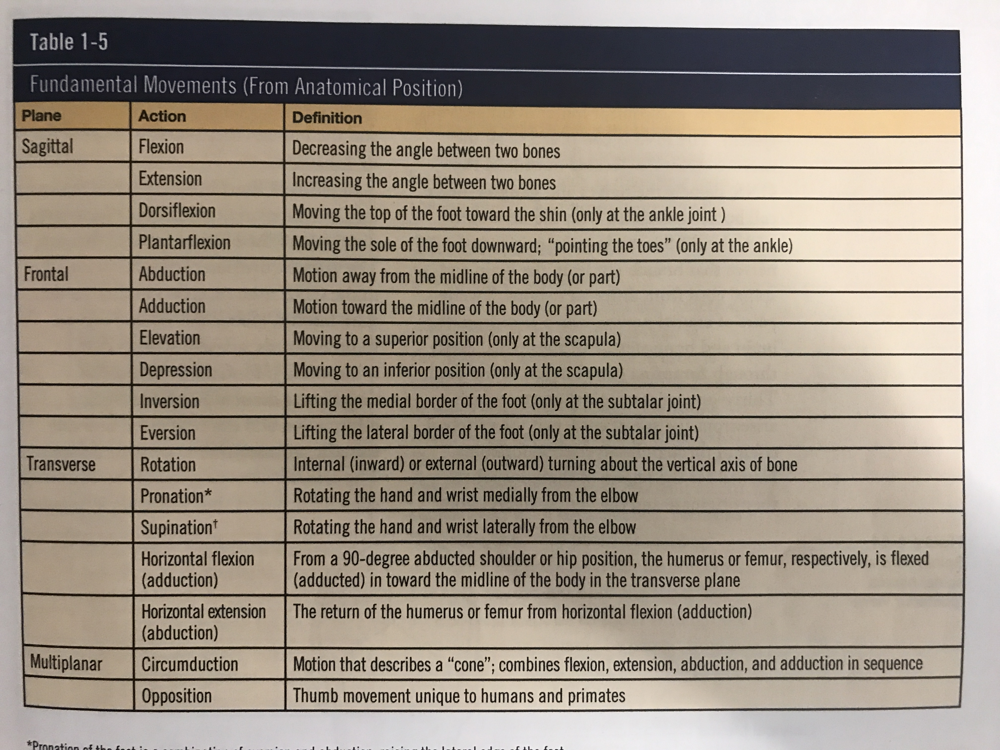
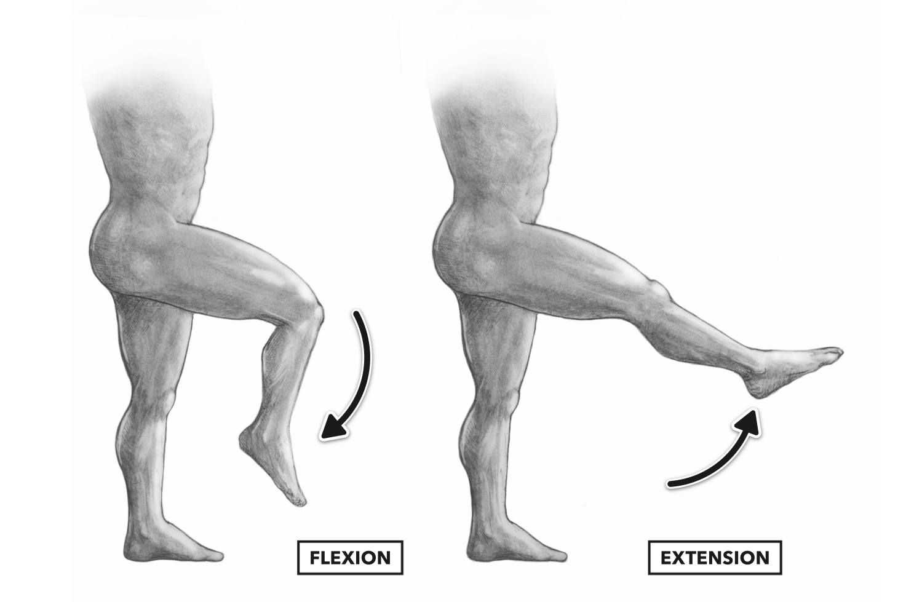
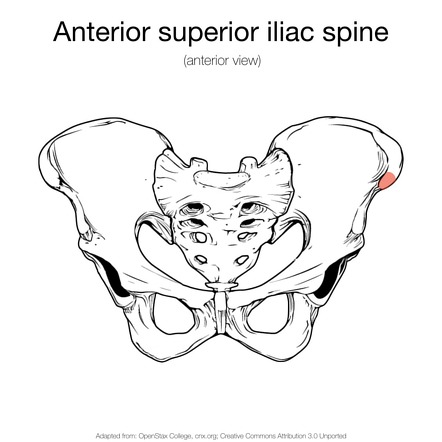

# 人体解剖学

## 解剖学术语

| 名称         |Term| 指向                                 |
| ------------ |---|------------------------------------ |
| 前部（腹侧） |Anterior (ventral)| 向前                                 |
| 后部（背侧） |Posterior (dorsal)| 向后                                 |
| 上方         |Superior          | 朝向头部                             |
| 下方         |Inferior          | 远离头部                             |
| 内侧         |Medial            | 朝向身体中线                         |
| 外侧         |Lateral           | 远离身体中线                         |
| 近端         |Proximal          | 朝向肢体的附着末端/结构起点/身体中线 |
| 远端         |Distal            | 远离肢体的附着末端/结构起点/身体中线 |
| 表面         |Superficial       | 外部；靠近或者在身体表面             |
| 深层         |Deep              | 内部；比表面结构更深                 |
| 颈的         |Cervical          | 颈的区域术语                         |
| 胸的         |Thoracic          | 颈部和腹部之间                       |
| 腰部的       |Lumbar            | 腹部和骨盆之间                       |
| 足底         |Plantar           | 脚底                                 |
| 背面         |Dorsal            | 脚和手的上表面                       |
| 掌           |Palmar            | 手的前面                             |
| 矢状面       |Sagittal plane    | 分成左右部分的面                     |
| 额状面       |Frontal plane     | 分成前后部分                         |
| 横切面       |Transverse plan   | 水平面                               |

解剖学姿势：人站直，头眼和手掌面向前方，双脚并立，脚趾朝前，双手垂于身体两侧。

四个人体结构： 细胞， 组织， 器官和系统

四种组织：肌肉(muscle)， 神经(nervous)， 结缔(connective)， 表皮(epithelial)

健身专业人士应对肌肉，神经和结缔组织的结构和功能有基本的了解。

## 动作基础

<table>
    <thead>
        <tr>
            <th>平面</th>
            <th>动作</th>
            <th>定义</th>
        </tr>
    </thead>
    <tbody>
        <tr>
            <td rowspan=4>矢状面 (sagittal)</td>
            <td>Flexion</td>
            <td>降低两个骨头之间的角度</td>
        </tr>
        <tr>
            <td>Extension</td>
            <td>增加两个骨头之间的角度</td>
        </tr>
        <tr>
            <td>Dorsiflexion</td>
            <td>移动脚尖靠近小腿</td>
        </tr>
        <tr>
            <td>Plantarflexion</td>
            <td>向下压低脚面</td>
        </tr>
        <tr>
            <td rowspan=6>额状面 (frontal)</td>
            <td>Abduction</td>
            <td>从身体中线离开</td>
        </tr>
        <tr>
            <td>Adduction</td>
            <td>靠近身体中线</td>
        </tr>
        <tr>
            <td>Elevation</td>
            <td>向上方移动</td>
        </tr>
        <tr>
            <td>Depression</td>
            <td>向下方移动</td>
        </tr>
        <tr>
            <td>Inversion</td>
            <td>抬起脚内侧</td>
        </tr>
        <tr>
            <td>Eversion</td>
            <td>抬起脚外侧</td>
        </tr>
        <tr>
            <td rowspan=5>横切面 (transverse)</td>
            <td>Rotation</td>
            <td>骨头垂直方面的内旋或者外旋</td>
        </tr>
        <tr>
            <td>Pronation</td>
            <td>从肘部向内旋转手腕</td>
        </tr>
        <tr>
            <td>Supination</td>
            <td>从肘部向外旋转手腕</td>
        </tr>
        <tr>
            <td>Horizontal flexion</td>
            <td>Adduction</td>
        </tr>
        <tr>
            <td>Horizontal extension</td>
            <td>Abduction</td>
        </tr>
        <tr>
            <td rowspan=2>多面 (multiplanar)</td>
            <td>Circumduction</td>
            <td>flexion -> extension -> abduction -> adduction</td>
        </tr>
        <tr>
            <td>Opposition</td>
            <td>大拇指运动</td>
        </tr>
    </tbody>
</table>

## 各大系统

### 心血管系统

血液通过心脏流到**动脉**，然后到**毛细血管**，再到**静脉**，最后返回心脏。主要功能就是输送。

动脉硬化导致动脉扩张能力下降，因此高血压。

相比起动脉壁，静脉壁更薄，弹性更小。下肢静脉常见瓣膜，使得血液只向心脏流动。（P5）

心脏的构成：上房下室，左二右三。

**心动周期**：一次心跳开始到下一次心跳开始的时间段。

心脏跳动时心脏右侧和左侧的两个心房同时收缩，将血液泵送到两个心室。

收缩期：心动周期的收缩阶段，血液离开心室。

舒张期：心动周期的舒张阶段，血液进入心室。

### 呼吸系统

气体在肺泡中交换。

两肺位于**横膈膜**上，由**纵膈膜**分开。横膈膜是唯一一块被认为是生命必须的骨骼肌。

**呼气**在正常时是被动的，不需要肌肉辅助；但在运动时呼气变为主动，例如腹直肌，腹内斜肌，后锯肌和肋间内肌帮助向下拉动胸腔。

定期的耐力锻炼可以提高呼吸肌的氧化能力，从而提高呼吸肌的耐力。提高呼吸肌的耐力对于中高强度活动有很大帮助。

### 消化系统

胃肠道是一个连续的管道，分为几个区域

- 口
- 咽
- 食管
- 胃
- 小肠
- 大肠

（P10）吞咽掉一口食物，叫做食团。食管的收缩运动称为蠕动，推动食团。

胃的化学作用：胃细胞诱使分泌物，去分解食物颗粒。

物理作用：研磨成悬浮颗粒，形成食糜——浓稠的液体混合物。胃会一直储存食糜，直到以最适合的消化和吸收速度进入小肠。

小肠是吸收食物的主要场所，食物则包括各种营养。因此，让胃以合适的速度送食物到小肠里非常重要。

小肠=十二指肠（20.3厘米）+空肠（2.4米）+回肠（3.7米）。在小肠里，肝脏和胆囊分泌的**胆汁**（帮助消化脂肪）和胰酶（帮助消化蛋白质，碳水和脂肪）。十二指肠和空肠中的**绒毛和微绒毛（上有毛细血管和淋巴管）**对大部分的食物分子吸收。

大肠里吸收水分和盐分，半固体废物排出肛门。饮食中的纤维和不可消化食物结成块。结肠肌帮忙处理。

### 骨骼系统

肌肉收缩，骨头通过关节移动，因此可以运动。

不断分解，将矿物质和其他物质释放到血液中，也在不断复原（成骨细胞，破骨细胞）。重塑过程修复骨骼损伤，防止过多老骨积聚。

骨骼里生成红细胞/白细胞/血小板。

| 骨的分类 | 特点               | 例子                                     |
| -------- | ------------------ | ---------------------------------------- |
| 长骨     | 轴比较长           | 肱骨，桡骨，尺骨，股骨，胫骨，腓骨，趾骨 |
| 短骨     | 长度和宽度几乎相等 | 腕骨，跗骨                               |
| 扁骨     | 薄而弯曲           | 颅骨，肋骨，胸骨                         |
| 不规则骨 |                    | 髋骨，椎骨                               |

沃尔夫定律是人体骨骼的一种成长定律：骨骼结构的变化与骨骼功能的变化一致。说人话：适应性变化。骨骼如果长时间接受外部压力，就会增大骨密度和坚硬程度；反之亦然。

骨骼系统按照位置分类：

- **中轴骨**：74块。提供主要的轴向支撑，保护中枢神经系统和胸腔器官。颅骨，脊柱，胸骨，肋骨。

    - 脊柱（重要）：33块。脊椎的力学会影响所有的运动效果。

        

- **附肢骨**：126块。

**关节分类**。按照连接骨头的物质分类。

- 纤维关节。通过纤维结缔组织连接，不能活动（不动关节）。颅骨的骨缝/胫骨和腓骨远端之间的关节。

    

- 软骨关节。通过软骨连接，很少/不能活动。

- 滑膜关节。可以自由活动（动关节）。四个性状特点：关节软骨，关节囊，滑膜，滑液。

    - 运动方式分类关节。关节的旋转轴使得它可以在各种平面上活动。

        - 单轴关节（铰链关节）。脚踝，肘部。
        - 双轴关节。脚，膝盖，手，手腕。
        - 多轴关节。臀部，拇指，肩部。

    - 活动类型

        - 

        - 成角活动：

            - 屈曲，伸展。在矢状面角度减小/扩大。肩关节和髋关节注意下就好。

                

                

            - 外展，内收。额状面远离/靠近身体中线。

    

### 神经系统

**按照功能分类**

- 中枢神经系统（CNS）：大脑和脊髓。接受 PNS 的感觉输入，并响应之。

- 周围神经系统（PNS）。按功能分为两类，传入神经，传出神经。

回忆流程：（感受器）-传入神经-CNS-传出神经-（效应器）。感受器处于：皮肤，筋膜，关节，内脏器官。

**按照可以自主控制分类**

- 躯体神经系统（不可）
- 自主神经系统
    - 交感神经系统。有应激源或者紧急情况出现时（剧烈疼痛，愤怒恐惧），交感神经系统被激活（“战逃反应”），动员所有资源应对压力。
    - 副交感神经系统。身体放松时助于消化，储存能量和促进发育。

两种肌腱感受器

- 高尔基腱器官（GTO）Golgi tendon organ
    - 位于muscle belly和tendon之间
    - 自体抑制 autogenic inhibition, 回应肌收缩并抑止其的过程
    - 会拮抗肌肉(antagonist)收缩
    - 肌肉疲劳时，拮抗力会降低（肌肉就可以收缩得更多）；
    - 会激活拮抗肌群
- 肌梭 muscle spindle
    - 位于muscle belly中，平行于肌肉纤维
    - stretch flex
    - 会拮抗肌肉放松 (reciprocal inhibition) *二头迅速拉伸，肌梭会导致其收缩，同时放松拮抗剂群三头，以用来提供更多的二头收缩*
    - 会减少使得该肌肉收缩的其他肌肉的收缩

举例：
静态拉伸 - static stretching
小力量和长时间的静态拉伸会因为肌肉被拉长而激活一个暂时肌肉张力的增长，在7-10秒后， GTO会被激活从而抑制肌梭的活动， 放松肌梭。

**神经系统的结构**
- **神经元 neuron** 是基本单位
- 细胞体 (cell body)
- 纤维延伸 (fibrous extensions)
    - dendrites - 传到电子脉冲到细胞体（入）
        - 每个神经元可能有上百个dendrites
    - axon - 从细胞体传送电信号出来（出）
        - 每个神经元只有一个axon
- 突触(synapse)是分离神经元之间的空间

**传送脉冲的步骤**
1. 第一个神经元释放**化学递质**(chemical transmitter substance)在下一个神经元隔膜(membrane)上的接收器(receptor)
2. Axon覆盖着**髓磷脂**(myelin)用来隔绝axon并且防止电流迁移出神经元
3. **感觉神经**(sensory nerves)把脉冲传入中枢神经系统，而**运动神经**(motor nerves)把脉冲从中枢神经系统传入周围神经系统
    - 运动神经和骨骼肌肉组成了**神经肌肉接点**(neuromuscular junction)

### 肌肉系统

- 骨骼肌 (skeletal)，也叫横纹肌（因为骨骼肌组织呈现出交替的亮带和暗带，呈条纹状）
    - 骨骼肌附着在骨骼上，通过收缩使骨骼运动。骨骼肌被认为是随意肌，只因为它通常受到个体意识的控制。
- 平滑肌 (smooth)
    - 处于中空器官壁和管壁
- 心肌 (cardiac)
    - 维持心脏的泵送作用

|        |          |          |
| ------ | -------- | -------- |
| 骨骼肌 | 随意肌   | 横条纹   |
| 平滑肌 | 非随意肌 | 非横条纹 |
| 心肌   | 随意肌   | 横条纹   |
|        |          |          |

#### 肌肉按功能分

肌腱是拉伸的方向。
- Tendon of origin: less mobile
- Tendon or insertion: more mobile

|        |                                  |        |
| ------ | -------------------------------- | ------ |
| 纵行肌 | 肌肉的两端都插入肌腱并和肌腱平行 | 缝匠肌 |
| 单羽肌 | 肌肉插入肌腱一侧，斜着           | 胫前肌 |
| 双羽肌 | 肌肉插入肌腱两侧，斜着           | 股直肌 |
| 多羽肌 |                                  | 三角肌 |

单羽肌和双羽肌比纵行肌运动更少，但是力更大。

#### 肌纤维类型

I(slow)和II (fast)。

I 更红：被更多的毛细血管包围，肌纤维中的肌红蛋白浓度比 II 更高。

总结一下就是

- IIx型肌纤维，又称为快速糖酵解纤维，维持状态的时间不超过几秒，更容易疲劳。
- IIa 型，又叫做中间型肌纤维或者**快速氧化糖酵解纤维**，介于 I和 IIx 之间。可以维持大约三分钟。IIa 具有高度适应性，他们的氧化能力能接近 I型肌纤维。(耐力训练可以增加IIa的氧化能力)
- 10-1里也说了， 抗阻训练后会发生少量的 IIa <=> IIx的适应性转化。

| 特點                         | 慢肌纖維 |          | 快肌纖維 |
| ---------------------------- | -------- | -------- | -------- |
|                              | Type I   | Type IIA | TypeIIX  |
| 運動神經元方面               |          |          |          |
| 運動神經元的大小             | 小       | 大       | 大       |
| **運動神經元被激發的閾值**   | 低       | 高       | 高       |
| **運動神經傳遞速度**         | 慢       | 快       | 快       |
| 結構方面                     |          |          |          |
| 肌纖維直徑                   | 小       | 大       | 大       |
| 肌漿網的發展                 | 小       | 多       | 多       |
| 线粒体密度                   | 高       | 高       | 低       |
| 微血管密度                   | 高       | 中       | 低       |
| 肌紅蛋白成分                 | 高       | 中       | 低       |
| 能量物質                     |          |          |          |
| PC儲備                       | 低       | 高       | 高       |
| 糖原儲備                     | 低       | 高       | 高       |
| 三甘油脂儲備                 | 高       | 中       | 低       |
| 酵素方面                     |          |          |          |
| 肌球蛋白－腺苷三磷酸酵素活動 | 低       | 高       | 高       |
| **糖酵解酶含量**             | 低       | 高       | 高       |
| **氧化酶活動**               | 高       | 高       | 低       |
| 功能方面                     |          |          |          |
| **抽搐（收縮時間）**         | 慢       | 快       | 快       |
| **放鬆時間**                 | 慢       | 快       | 快       |
| **產生力量**                 | 低       | 高       | 高       |
| **能量產生的效率**           | 高       | 低       | 低       |
| **抵禦疲勞的能力**           | 高       | 低       | 低       |
| 彈性                         | 低       | 高       | 高       |

#### 肌肉的结构和收缩的过程

筋膜分肌外膜（包裹一束一束的肌纤维）和肌内膜（包裹单独的肌纤维）。

每个肌纤维有几百到几千个相互平行的**肌原纤维**(myofibril)。明暗相间的横条纹的成因是肌球蛋白丝 - myosins（暗）和肌动蛋白丝 actin（亮）。

收缩的过程 p29
1. Acetylcholine is detected.
2. Calcium is released
3. Actin binding sites exposed for myosin to attach
4. When ATP is plentiful the sites will bind easily and form a cross-bridge
5. Myosin pulls actin towards center, sarcomere shortens
6. Several fibers stimulated at the same time muscle contracts

##### 结缔组织 Connective Tissue

Collagen fiber - 胶原蛋白
Inextensibility and tensile strength
由许多蛋白质构成，**包括胶原蛋白**，**胶原蛋白是人体中最丰富的蛋白质**，**含有大量胶原蛋白的结构会限制运动和抵抗拉伸**。胶原纤维是**韧带、肌腱**的主要组成部分。

Crimp - Wavelike folds of collagen fibers
条带和波褶->胶原纤维丝->亚纤维->原纤维->肌束(Perimysium)。

结缔组织还有**弹性蛋白**(Elastin)，容易被拉伸。Found in extensible fibers and can stretch up to 150%

**肌腱**(tendon)、**韧带**(ligaments)和**筋膜**(fascia)是与训练最相关的结缔组织。肌筋膜与柔韧性和运动范围直接相关（P31）
> Tendon: connect muscle to bone
> Ligament: attaching bone to another bone
> Fascia: superficial, deep intramuscular, known to be all the other connective tissue in the body

- 可以提供一个确保肌纤维、血管和神经正常排列的框架（就是不让他们缠在一起，隔开）
- 让力在整个肌肉中安全有效地传递
- 在肌肉纤维之间润滑，使肌肉在收缩和伸长过程中变形状

和柔韧性相关的因素

- 年龄越大，肌纤维萎缩
- 男性
- 既往伤害

- 温度越低
- 清晨相比下午

柔韧性更低

各个部分的具体肌肉，边用边看。

#### 肩胛带的肌肉

肩胛带指的是：锁骨内侧端和胸骨连接处、锁骨内侧端和肩胛骨连接处、肩胛骨和胸部的软组织连接处以及肩胛骨与肱骨头连接处的关节。

**Rotator cuff** (SITS)
- supraspinatus
- infraspinatus
- subscapularis
- teres minor

作用: 包围肱骨(humerus)的顶部，作用于保持和稳定在关节窝(glenoid fossa)的肱骨头部
肩关节缺乏骨骼支持会使Rotator cuff的肌肉和相应的跟腱一起来稳定并且防止肱骨在关节窝的半脱位和脱臼
都是源于肩胛骨

**三角肌 deltoid**
- 前束纤维(anterior fibers)向内屈曲和向内旋转肱骨
- 后束纤维(posterior fiber)延申和横向旋转肱骨

**Teres major**
从肩胛骨中底部发起，主要作用域内旋肱骨

#### 肩关节的肌肉

肩关节：带关节窝的肱骨头关节，以及肩胛骨的相关软骨。

结构参见[第八章](../ACE-Notes/ACE-chap05.md/#俯卧撑测试)和[第九章](../ACE-Notes/ACE-chap09.md/#肩关节说明)。

#### 肘部关节

P38

#### 腕关节

P39

#### 躯干关节

P41

#### 臀部肌肉

P42

#### 膝部、踝部肌肉

#### 腿部肌肉
股四头肌 Quadricep femoris
- 同心运动时(concentrical)主要作用于膝盖的伸展(extension)
- 四个肌肉(rectus femoris, vastus intermedius, vastus lateralis, vastus medialis)都包含和共用一个韧带附着点(tendon of insertion) - patellar tendon 髌韧带
-----
绳肌 Hamstring
- 同心运动时(concentrical)主要作用与膝盖的屈曲(flexion)和髋部的伸展(extension)
- 下绳肌,又叫做股二头肌(bicep femoris)作用域膝盖外旋

-----
缝匠肌 sartorius
- 身体最长的肌肉, 从髂前上棘(Anterior superior iliac spine - ASIS)到插入到在膝盖下方的胫骨内侧(medial tibia)

- 屈曲(flex)，外展(abduct), 外旋髋部(hip)
- 屈曲， 内旋膝盖

##### Fiber Hypertrophy
- 增长的肌原纤维 (myofibrils)
- 增多的肌动蛋白(actin)和肌球蛋白(myosin)细丝
- 更多的肌质(sarcoplasm)
- 更多的结缔组织(connective tissue)
- 增多蛋白质合成(protein synthesis)

研究证明，离心收缩(eccentric)组合高速训练(high-velocity training)要比同心收缩(concentric)组合低速训练(low-velocity training)更利于肌肥大

##### Fiber Hyperplasia
每一个肌肉纤维分裂为两个细胞，每一个细胞可以发展为新的肌肉纤维

Enhancing muscle Growth through exercise
- 生长激素 Growth hormone 
    - 提升蛋白质合成所需的氨基酸，降低葡萄糖的获取
    - 加速脂肪酸的移动用来供能
    - 刺激胰岛素生长因子-1 (IGF-1)来增加肌肉细胞的生长
- 睾酮 Testosterone
    - 增加脑垂体促进生长因素的分泌
    - 和神经肌肉互相交互促进肌肉生长
- 肌肉增长的一些研究
    - 高强度
    - 较短的组间休息
    - 训练前后的碳水和蛋白质补充

### 内分泌系统

P49

生长激素促进氨基酸进入细胞，还将脂肪酸释放到血液中作为能量，促进葡萄糖生成并释放进血液。

p31-33
影响灵活性的因素
- 年龄
    - 年龄增大，肌肉功能（力量，耐力，灵活性，敏捷度）都会下降
    - 力量训练会将肌肉纤维的减少最低化
- 性别
    - 女性比男性更灵活，女性的身体构造决定
- 关节结构和伤病史
    - 组织温度
        - 最佳的热身温度为39c
    - 时昼变化
        - 下午的灵活度比早上高
        - 人的身高会平均每天变化1.6cm, 脊椎骨之间在晚上被拉伸，白天被压缩
        - 清晨脊椎受伤的几率高些， 膨胀脊椎会增加脊柱的疲劳度
        
 总结： 灵活度的训练项目应该在一天中的下半天，降低受伤的风险
        
